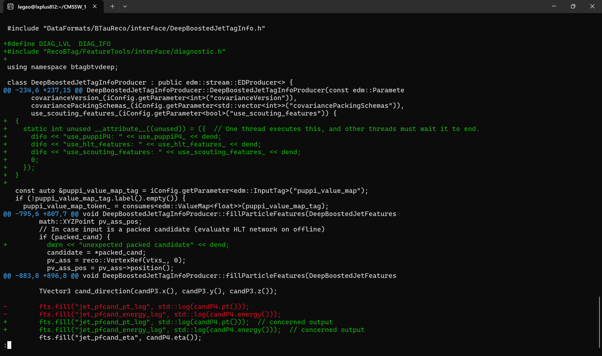
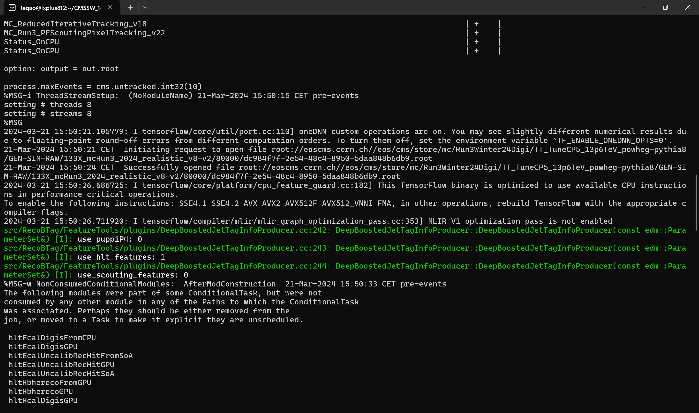

# Updates on Mar 21

Current directory structure:

```
[legao@lxplus812 src]$ pwd
/afs/cern.ch/user/l/legao/CMSSW_14_0_0/src
[legao@lxplus812 src]$ tree -L 2
.
|-- BTVTools
|   `-- hltupler
`-- RecoBTag
    `-- FeatureTools

4 directories, 0 files
```

Logging interpositions:



Run the trail command:

```
[legao@lxplus812 hltupler]$ cmsRun analyzers/HLT_btag_jet_analyzer.py inputConfig=python/Run3_CMSSW_14_0_0.py isMC=True maxEvents=10
customizeHLTForAK4PNET --> in order to create PAT containers for AK4 PNET
Keep paths:
------------------------------------------------------------------------------------------------------------
HLT_AK8PFJet220_SoftDropMass40_PNetBB0p06_DoubleAK4PFJet60_30_PNet2BTagMean0p50_v3                  | +    |
HLT_AK8PFJet220_SoftDropMass40_PNetBB0p06_DoubleAK4PFJet60_30_PNet2BTagMean0p53_v3                  | +    |
...
```



The variable `candP4` comes from `DeepBoostedJetTagInfoProducer.cc:609`:

```c++
 609     // input particle is a packed PF candidate
 610     auto candP4 = use_puppiP4_ ? puppi_wgt_cache.at(cand.key()) * cand->p4() : cand->p4();
 611     auto candP3 = use_puppiP4_ ? puppi_wgt_cache.at(cand.key()) * cand->momentum() : cand->momentum();
```

Now the flag `use_puppiP4_` is false, otherwise, `puppi_wgt_cache` from `DeepBoostedJetTagInfoProducer.cc:463` will be used:

```c++
 463 float DeepBoostedJetTagInfoProducer::puppiWgt(const reco::CandidatePtr &cand) {
 464   const auto *pack_cand = dynamic_cast<const pat::PackedCandidate *>(&(*cand));
 465   const auto *reco_cand = dynamic_cast<const reco::PFCandidate *>(&(*cand));
 466
 467   //
 468   // Access puppi weight from ValueMap.
 469   //
 470   float wgt = 1.;  // Set to fallback value
 471
 472   if (pack_cand) {
 473     if (use_puppi_value_map_)
 474       wgt = (*puppi_value_map_)[cand];
 475   } else if (reco_cand) {
 476     if (use_puppi_value_map_)
 477       wgt = (*puppi_value_map_)[cand];
 478   } else
 479     throw edm::Exception(edm::errors::InvalidReference)
 480         << "Cannot convert to either pat::PackedCandidate or reco::PFCandidate";
 481   puppi_wgt_cache[cand.key()] = wgt;
 482   return wgt;
 483 }
```

I wonder whether `puppi_wgt_cache.at(cand.key())` is the jet energy correction factor we previously referred to. And I want to confirm my conceived next steps.
